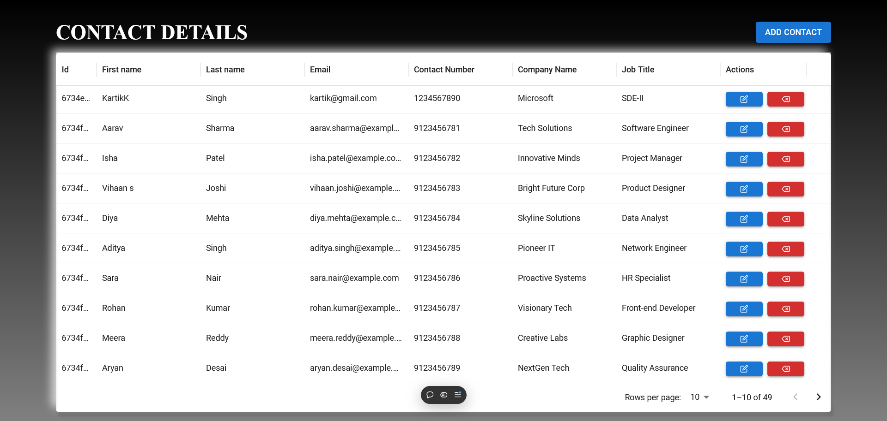

# Erino ⭐ 🌟

# Use Cases
**Adding a New Contact:** Users should be able to add a contact with essential details like name, email, phone number, company and job title. This allows users to add new customers.
**Viewing Contacts:** A table view should list all contacts, with sorting and pagination options to make large contact lists easier to browse. This lets users efficiently locate any contact's information.
**Editing Contact Information:** Users can update contact details when information changes, such as a new phone number or company. Keeping data current ensures effective communication and reliable records.
**Deleting a Contact:** Users may need to remove outdated or duplicate entries, helping them keep their contact list clean and relevant.




## Getting Started

To get started with Erino, follow these steps:

### Prerequisites

Ensure you have [Node.js](https://nodejs.org/) installed on your machine.

### Installation

1. **Clone the repository:**

   ```bash
   https://github.com/hritikpathak06/Erino.git
   ```

**For Server**
   ```bash
   cd server
   npm install
   npm run dev
   ```

**For Client**
   ```bash
   cd client
   npm install
   npm run dev
   ```
   
   
